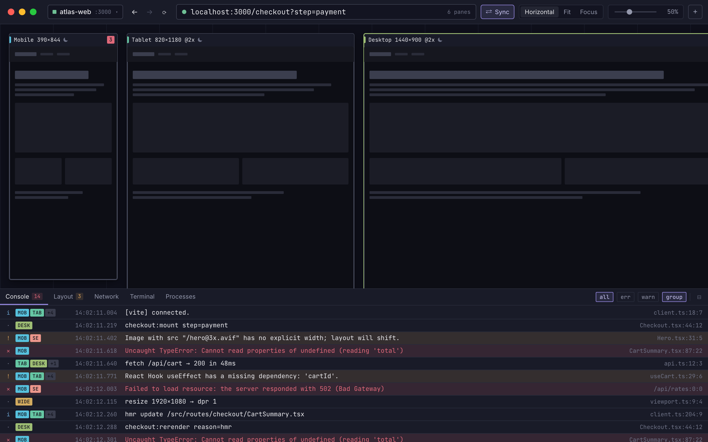

# Breakpoint

**A multi-viewport dev browser for developers and their coding agents.**

Breakpoint renders one URL at several viewport sizes at once, keeps them in sync, and shows
one console for all of them. Everything you can see or do in the window, a coding agent can
see or do from the command line — so the agent edits code, then checks real renders, real
console output and real layout at every breakpoint, in the window you are already watching.



> [!WARNING]
> **v0.1.0 is Phase 1 of 7.** Panes, emulation, presets, layouts, projects, certificates and
> the CLI foundations are built. The console, scroll and navigation sync, screenshots and
> layout checks are not. This is a pre-release: it is useful, and it is not finished.
> [What each phase adds →](docs/breakpoint-prd.md)

## Install

**[Download the latest release →](https://github.com/jim-at-jibba/breakpoint/releases/latest)**

Breakpoint is not code-signed yet, so macOS will refuse to open it until you say otherwise.
This is one command, and it is the same one for the `.dmg` and the `.zip`:

```sh
# 1. Move Breakpoint.app to /Applications, then:
xattr -dr com.apple.quarantine /Applications/Breakpoint.app
```

Now open it normally. No `sudo`, and you only do this once per install.

<details>
<summary>What that command does, and the alternative if you would rather not run it</summary>

macOS tags every downloaded file with a `com.apple.quarantine` attribute. Gatekeeper sees
the tag, finds no Apple-issued signature, and blocks the app with _"Apple could not verify
Breakpoint is free of malware"_. `xattr -dr` removes the tag; it does not disable Gatekeeper
or change any system setting.

The GUI alternative: open Breakpoint, let it be blocked, then go to **System Settings →
Privacy & Security** and press **Open Anyway**. That button only appears for about an hour
after the block.

Right-click → Open **no longer works** — Apple removed that bypass in macOS 15.

Signing and notarisation are Phase 5. See
[ADR-0017](docs/adr/0017-releases-are-unsigned-and-say-so.md) for why they are deferred
rather than skipped.

</details>

## The `breakpoint` command

The CLI is the same binary as the app, so there is nothing separate to download. What there
is not yet is something that puts it on your `PATH` — a menu item to do this is Phase 5.
Until then, write the launcher yourself. It is five lines and you can read all of them:

```sh
sudo tee /usr/local/bin/breakpoint >/dev/null <<'EOF'
#!/bin/sh
APP="/Applications/Breakpoint.app"
exec env ELECTRON_RUN_AS_NODE=1 "$APP/Contents/MacOS/Breakpoint" \
  "$APP/Contents/Resources/app.asar/out/main/cli.js" "$@"
EOF
sudo chmod +x /usr/local/bin/breakpoint
```

Check it:

```sh
breakpoint --help
```

Then, from any repo:

```sh
breakpoint .
breakpoint open 3000 --wait
breakpoint state --json
```

`breakpoint .` opens the project for that repo, creating it the first time, and starts the
app if it is not already running. [Full CLI reference →](https://breakpoint-app.netlify.app/docs/cli/)

## Platform support

| Platform                                                     | Status                                               |
| ------------------------------------------------------------ | ---------------------------------------------------- |
| **macOS 13+** (Apple silicon and Intel, one universal build) | Supported — this is where it is developed and tested |
| **Windows**                                                  | Builds and runs; nobody has used it in anger         |
| **Linux** (AppImage, deb)                                    | Builds and runs; nobody has used it in anger         |

Known defects on Windows and Linux, all cosmetic or cancelled by workarounds:

- **The window has two title bars.** The frameless window is implemented for macOS only, so
  you get the native title bar _and_ Breakpoint's toolbar, with an empty gap on the left
  where the macOS traffic lights would be.
- **There is no `breakpoint` launcher.** The snippet above is `/bin/sh`, so it works on
  Linux with the path changed, and not at all on Windows. On Windows, call the CLI entry
  inside the install directory directly.

Windows and Linux artifacts are published so they can be tried, not because they are ready.
Issues from either are welcome and useful.

## Build from source

```sh
git clone https://github.com/jim-at-jibba/breakpoint.git
cd breakpoint
npm install
npm run dev
```

Requires **Node.js 22+**. `npm run dev` starts the app with hot reload for the renderer; the
main process restarts on change. A source checkout has its own launcher at `bin/breakpoint`,
which resolves the repo it sits in — symlink it onto your `PATH` after `npm run build`.

| Command                           | What it does                                                             |
| --------------------------------- | ------------------------------------------------------------------------ |
| `npm run build`                   | Type-checks, then builds main, preload and renderer                      |
| `npm run build:mac`               | Builds and packages a universal macOS app                                |
| `npm run build:unpack`            | Builds an unpacked directory, useful for debugging packaging             |
| `npm run typecheck`               | Type-checks the node and web projects                                    |
| `npm run test:unit`               | Vitest, over the shared module both processes import                     |
| `npm run test:e2e`                | Builds, then Playwright launches the real app and drives it with the CLI |
| `npm run lint` / `npm run format` | ESLint / Prettier across the repo                                        |

> [!NOTE]
> Quit any running Breakpoint before `npm run test:e2e`. The app takes a single-instance
> lock, and a running instance makes the Playwright launch time out in a way that looks
> like a regression.

## Documentation

- **[Docs](https://breakpoint-app.netlify.app/docs/)** — install, quickstart, and the full CLI reference.
- **[PRD](docs/breakpoint-prd.md)** — what is being built, in what order, and why.
- **[ADRs](docs/adr/)** — the decisions that are expensive to reverse.
- **[CONTEXT.md](CONTEXT.md)** — the project's vocabulary. Worth skimming before reading any code.
- **[CONTRIBUTING.md](CONTRIBUTING.md)** — how to help.
- **[AGENTS.md](AGENTS.md)** — point your coding agent at this.

## Licence

[MIT](LICENSE.md) © James Best
